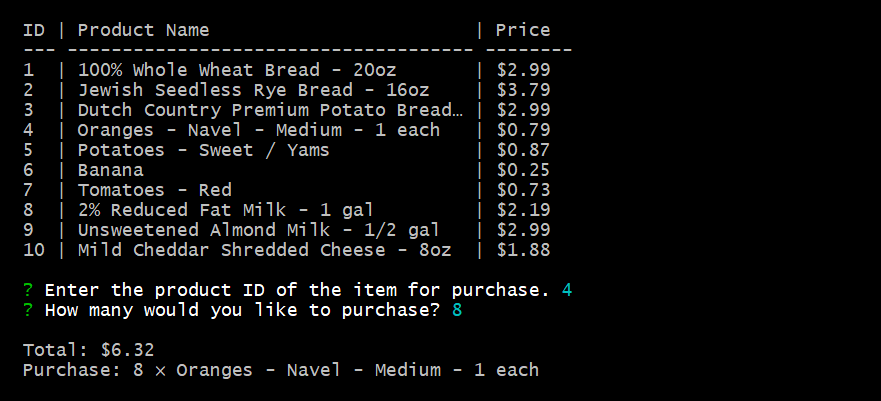
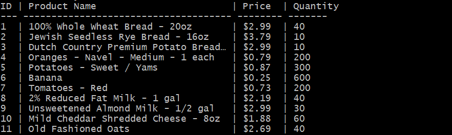
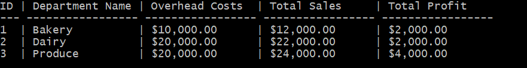

# 🅱amazon

A CLI for a mock storefront. It's three separate apps which interact with the same database, giving a customer view, a manager view, and a supervisor view.

It runs in [Node.js](https://nodejs.org) and uses [MySQL](https://www.mysql.com/) for its database.

## Installation

1. Run `schema.sql` and then `seeds.sql` in MySQL to initialise the database.
2. The three apps use the same dependencies, so running `npm install` in the root directory works for all three.

## Customer

This lists available products and allows a user to order an item.

## Manager

This gives a few available commands for a prospective manager.

- View Products for Sale
- View Low Inventory
- Add to Inventory
- Add New Product

## Supervisor

This provides a few services for a supervisor.

- View Product Sales by Department
- Create New Department

